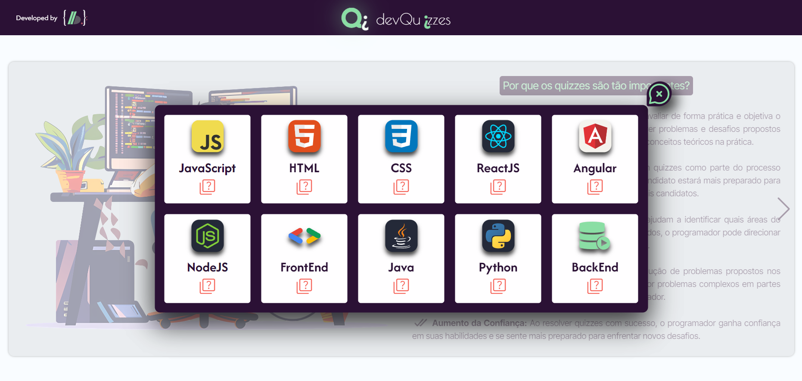

# ⁉️ Programming Quiz



## Sobre o Projeto:

Este projeto apresenta um quiz interativo sobre programação com as seguintes funcionalidades:

- Escolha de Temas Diversificados: O usuário pode selecionar entre diversos temas relacionados à programação, como JavaScript, HTML, CSS, ReactJS, Angular, NodeJS, entre outros.

- Persistência de Dados: As respostas e progresso do quiz são salvos no localStorage, permitindo ao usuário ter um controle contínuo sobre os quizzes que já completou.

- Detalhamento das Questões: Cada questão do quiz oferece um detalhamento completo, mostrando a resposta escolhida pelo usuário, a resposta correta e uma explicação detalhada sobre por que essa é a resposta correta.

- Popup de Resultado: Ao finalizar o quiz, um popup é exibido mostrando o resultado final, incluindo a quantidade de questões acertadas, a pontuação total e a porcentagem de acertos.

- Indicação de Quiz Realizado: Quando o usuário volta para a página inicial para escolher outro quiz, os quizzes já realizados estarão marcados com um símbolo de check, facilitando o controle do progresso.

- Essas funcionalidades garantem uma experiência de aprendizado interativa e completa, ajudando os usuários a melhorarem seus conhecimentos em programação de forma divertida e educativa. 🎉🚀

## 📌 Começando

Para ter acesso a esse projeto, faça os seguintes passos:

### **1. Pré-requisitos:**

- **IDE:** Garanta que tenha uma IDE instalada na sua máquina (por exemplo, Visual Studio Code).

- **Extensão para Servidor Local:** Instale uma extensão na sua IDE que permita iniciar um servidor local para visualizar o projeto (como Live Server).

- **Node.js e npm:** Certifique-se de que o Node.js e o npm estão instalados na sua máquina.

### **2. Instalando:**

Clone o repositório em sua máquina local:

```bash
git clone https://github.com/code-front-braga/PR-Quiz_Programming.git
```

#### **1. Instalando as dependências:**

Para instalar as dependências de desenvolvimento, faça o seguinte comando:

```bash
npm i
```

### **3. Executando o projeto:**

#### **1. Compilar TypeScript:**

Para compilar os arquivos TypeScript para JavaScript, execute o seguinte comando:

```bash
npm run dev
```

#### **2. Iniciar Servidor Local:**

Se você estiver usando uma extensão como o Live Server no Visual Studio Code, você pode iniciar o servidor diretamente pela interface da IDE. Alternativamente, use o comando:

```bash
npx live-server
```

Isso abrirá o projeto no seu navegador padrão. Ou se quiser ver somente o funcional, eu hospedei o projeto no Vercel: [Programming Quiz](https://pr-quiz-programming.vercel.app/index.html)

## 🧑🏻‍💻Tecnologias utilizadas:

<div style="flex-basis: 48%;">


  
</div>
<br>
<br>

## 🔄️ Melhorias Futuras:

Esse projeto já está repleto de funcionalidades incríveis, mas sempre há espaço para melhorias! Aqui vão algumas futuras funcionalidades planejadas:

- Botões para Refazer Quiz: Pretendo adicionar botões que permitam refazer quizzes já concluídos. No modelo atual, ao completar um quiz, o usuário só pode refazê-lo limpando o cachê do navegador ou deletando pelo próprio localStorage.

- Níveis de Dificuldade: Planejo implementar níveis de dificuldade, proporcionando um desafio mais adequado ao nível de conhecimento do usuário.

- Cards de Status Detalhados: Cada tema terá um card mostrando status detalhado, incluindo questões acertadas, porcentagem de acerto, nível de dificuldade realizado, tempo de conclusão do quiz e dicas de estudo.

## 📝 Licença:

Este projeto está licenciado sob a licença MIT.
<br>
<br>

## 🧑🏻‍💻 Autor:

<a href="https://github.com/code-front-braga" style="text-align: justify;">

</a>
